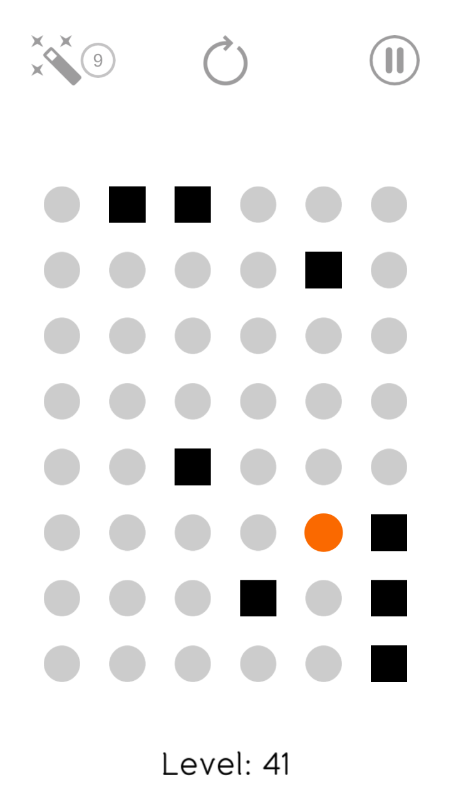
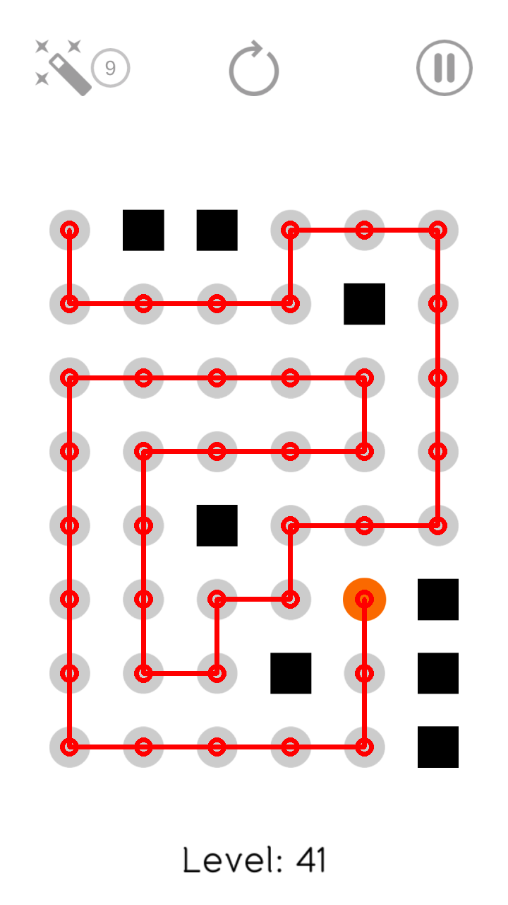

# Find A Way

Python solver for Android game [Find A Way](https://play.google.com/store/apps/details?id=com.zerologicgames.findaway)

## Usage:
    
    python faw.py [image]

## Required modules:
- cv2
- networkx

## Example

<table>
<tr>
<td>
Input: 

</td>
<td>
Output: 

</td>
</tr>
</table>